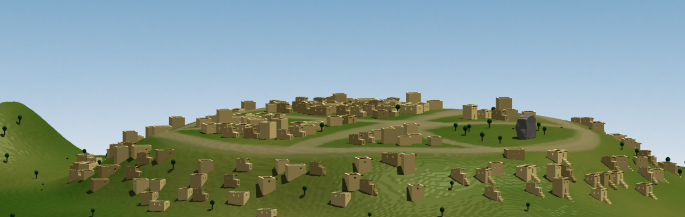
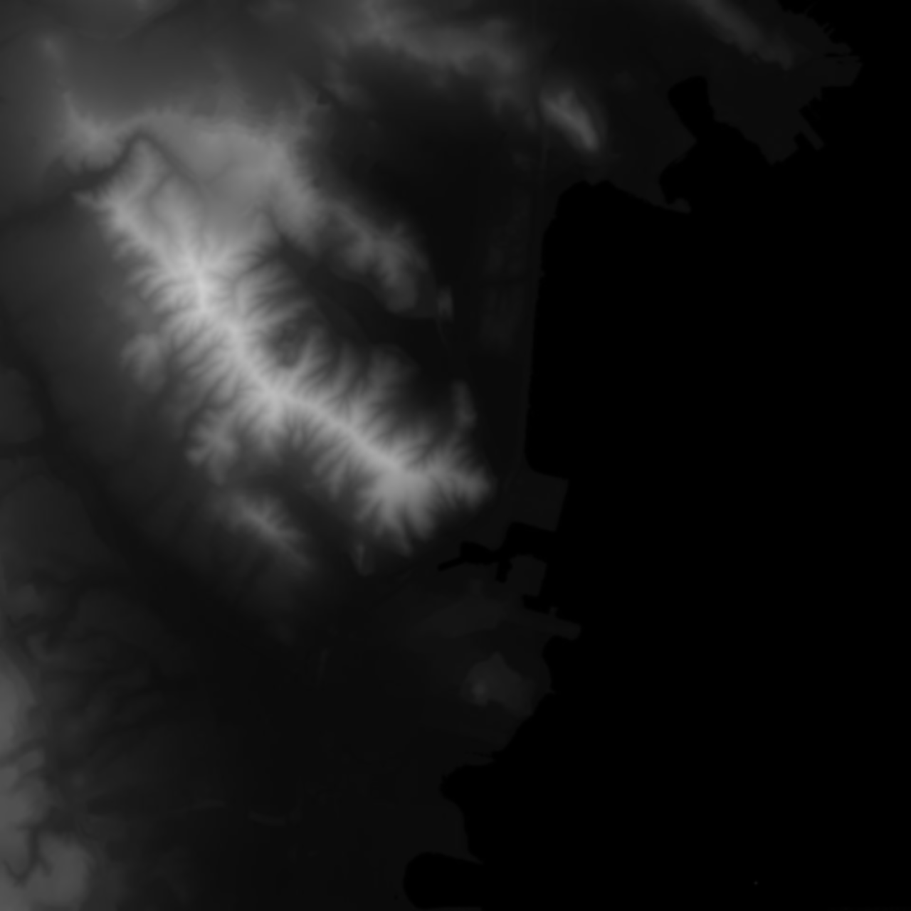
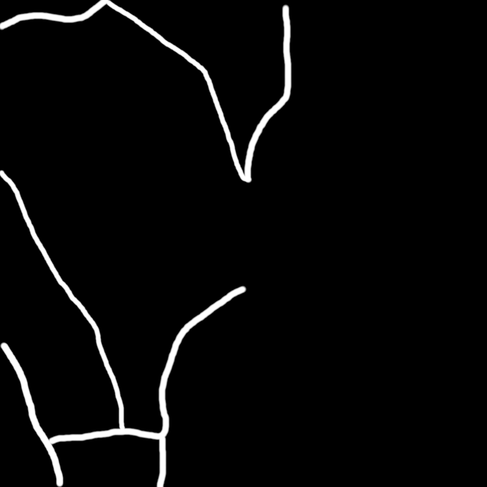
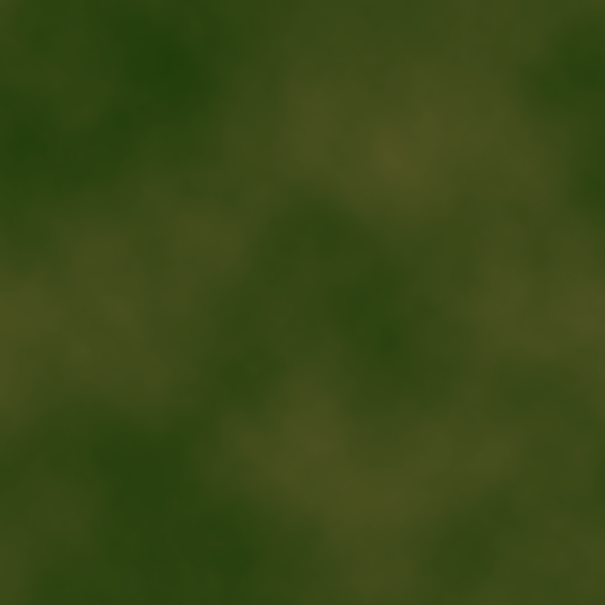
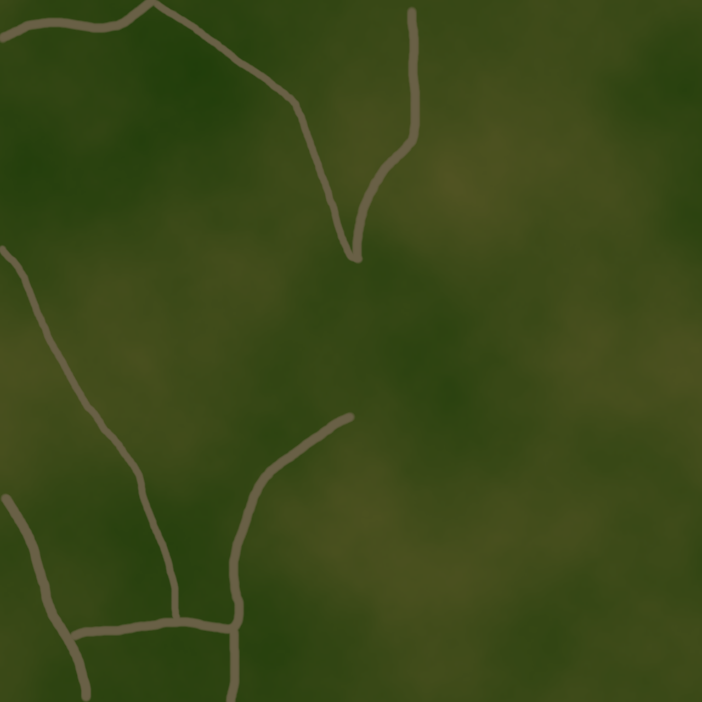
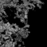

# Web-Based 3D Pictorial Maps with Data-Driven Procedural Placement



This repository contains a tool for creating and displaying 3D Pictorial Maps
using Procedural techniques. It is divided in a Python script (backend) which
runs Procedural Placement of assets using data as input and generates output
data representing the placement. The input data are ecotope definitions in JSON
format, and image files for height maps and density maps for each ecotope. Then
the frontend is a Javascript Web App that uses three.js. The frontend also works
using data as input which are 3D models in glTF format, and placement and terrain 
information given in JSON format.

For a detailed explanation on the algorithm used, read the
[paper](docs/paper.pdf)

You can see the Web App [here](https://henryxz.github.io/pictorial-map)

## How to run your server locally

Use any local server tool from the project root, like Visual Code, Brackets, 
Python or Jekyll.

With Python:

Run `$ python -m http.server` and then open your browser in `localhost:8000`.

With Jekyll:

Run `$ jekyll s` and then open your browser in `localhost:4000`.


## How to create a new map

You can create your own new maps procedurally, and they will be available to see
in the Web App. To create a new map there are some files that you will need 
to create first that will be used as input in the Procedural Placement 
script. After you run the script new data will be generated that will be 
used by the Web App. You will also need to copy an HTML page for your new map to
show.

### Steps

1. [Create input data](#create-input-data)
2. [Run Procedural Placement script](#run-procedural-placement-script)
3. [Create HTML page](#create-html-page)
4. [(Optional) Adding more 3D assets](#adding-more-3d-assets)

### Create input data

First create a new folder inside *assets* with the name of your map. Then you 
will need to create the following files inside your map's folder:

- config.json
- height_map.png
- surface.png
- ecotopes.json

Let's see what each of them means:

#### Config

You will need a config.json file that will have a format like this:

```json
{
  "maxHeight": 83,
  "densityMapPixelSize": 5,
  "heightMapPixelSize": 1,
  "roadColor": [105, 96, 70],
  "groundColor": [29, 60, 9],
  "darkColor": [88, 87, 38]
}
```

**maxHeight** is the maximum height that your map will have in world units.
This is the height that would be assigned for a pixel in the height map that 
has maximum value (255). 

**densityMapPixelSize** and **heightMapPixelSize** are 
how long a side of a pixel in the density and height map are in world units. 

**roadColor** is the RGB color that a road would have if one is given 
(through a road_map.png), 
**groundColor** and **darkColor** are optional and are only used for creating a 
texture for the terrain if the *create_tex_script* is used. That script creates
an image texture *surface.png* that can be used in the terrain.

####  Height Map

You need a height map that will be a grayscale image. Each pixel will 
represent the height of the terrain at the corresponding point in the map.



Example of a height map

#### (Optional) Road Map

This is a grayscale image where each pixel with value greater than 0 is part 
of a road. The script won't place any assets in the roads, and assets 
without the *allowRotation* will be oriented to face the nearest road.



Example of a road map

####  Surface

Your map will need a *surface.png* that will be the texture for the terrain 
when it's displayed by the Web App. If you want to have the road painted 
in the terrain, you can provide a *ground.png*, then the function 
*paint_surface* will paint the road into that texture and will create a new 
*surface.png* for the map. Note that for that to work properly the textures 
have to be of the same size.

||     |
|-----|-----|
| Ground | Surface |

####  Ecotopes

An ecotope is a group of assets where each asset has a probability. For your 
map, you will define ecotopes in the ecotopes.json file and will look like this:

```json
[
  {
    "name": "forest",
    "priority": 1,
    "footprint": 5,
    "data": [
      {
        "assetId": 2,
        "probability": 0.8,
        "footprint": 2,
        "allowOffset": 0.5,
        "allowScale": 0.3
      },
      {
        "assetId": 3,
        "probability": 0.2,
        "footprint": 0.5,
        "allowRotation": "full",
        "allowOffset": 2,
        "allowScale": 0.3
      }
    ]
  },
  {
    "name": "houses",
    "priority": 2,
    "footprint": 8,
    "data": [
      {
        "assetId": 1,
        "probability": 0.2,
        "allowOffset": 0.25,
        "allowScale": 0.2,
        "allowRotation": "random"
      },
      {
        "assetId": 3,
        "probability": 0.05,
        "allowOffset": 2,
        "allowScale": 0.3,
        "allowRotation": "full"
      }
    ]
  }
]
```

In the example there is one ecotope called **forest** which has assets like 
trees and rocks, and then **houses** which has one type of house and rocks.

The field assetId is the ID of the asset refered to. One must define assets with
their IDs in an *assets.json* file inside the *js* folder of the project root. 
Here is an example of that file:

```json
[
  {"id": 1, "name": "square house", "filepath": "../assets/square.glb"},
  {"id": 2, "name": "tree", "filepath": "../assets/tree.glb"},
  {"id": 3, "name": "rock", "filepath": "../assets/rock.glb"},
  {"id": 4, "name": "tall house", "filepath": "../assets/tall.glb"}
]
```

The *assets.json* file is in the *js* folder because assets are independents 
of maps, and they can be reused in different maps.

Ecotopes have a **priority** meaning that the ones with lower value are placed 
first (it's more like an order), so if a tree is placed first then there 
won't be any house placed in the same spot. They also have a **footprint** 
which is the 
length of the side of a squared region in which assets are placed. Then 
**data**,
defines the assets associated with each ecotope and the probability they 
have. That means for example, that if a forest has a probability of 0.7 for 
trees and 0.3 for rocks, on average you could expect that around 70% of the 
places assigned to forest will have a tree on them and 30% a rock.

The field **allowOffset** is a float value that allows a random offset not 
greater than the given value, when placing assets, similarly with 
**allowScale**. In the case of **allowRotation**, the value given is the 
maximum value for a random rotation in the up axis (y), but you can also give
the value *"full"* meaning that it will be rotated randomly in all 3 axis. If 
an asset doesn't have **allowRotation** defined and there is a road, it will be 
rotated to face the nearest road, if there isn't any road, it will have 0 
rotation.

#### Density Maps

Each ecotope will need a density map, with the format
*<ecotope_name>_density_map.png* which is a grayscale image that 
associates how densely populated is each area of the map by each ecotope. So 
for example, the forest area would have high values in the
*forest_density_map.png*, but only black pixels in *houses_density_map.png*. 
Procedural Placement uses that information to decide which assets to place 
and how frequently.

**All your density maps have to be of the same size in
pixels and make sure that your densityMapPixelSize multiplied by the size in 
pixels is the same as the heightMapPixelSize multiplied by the size in 
pixels of the height map (meaning they cover the same area)**



Example of a density map (size is 80x80 in this case)

### Run Procedural Placement script

Before you run the script make sure you add the name of your map to the 
*maps.json* file that is in the *js* folder. You should put the same name of
the folder where your map is stored. So for example, if your current
*maps.json* file looks like this:

```json
["shechem", "jerusalem"]
```

And you want to add a knew map called *samaria*, then update the file to 
look like this:

```json
["shechem", "jerusalem", "samaria"]
```

After that, you need to run:

`$ python main.py`

And choose a map to run the Procedural Placement there. That will generate 
new files inside the map's folder like placement maps for each ecotope and a 
*placement.json* file that has all placement information.

### Create HTML page

To be able to view the newly generated map, copy one of the other map's 
folder, but the one in the project root, not in the *assets* folder. Then 
rename it to have the name of your new map and modify the *index.html* that is 
inside so that the **title** has the name of your new map.

### Adding more 3D assets

If you want to add new 3D assets for your project, just copy them inside the 
*assets* folder and modify the *assets.json* file inside the *js* 
folder to define the new assets, including ID, name and filepath. Notice 
that **they have to be in glTF format (since the JS script uses GLTFLoader 
from three.js)**.

## Dependencies

For Python:

- Numpy
- Pillow

You can install them by running `python -m pip install numpy Pillow`

For Javascript, nothing 🙂 (not dependent of npm, and three.js is used with a 
CDN)
